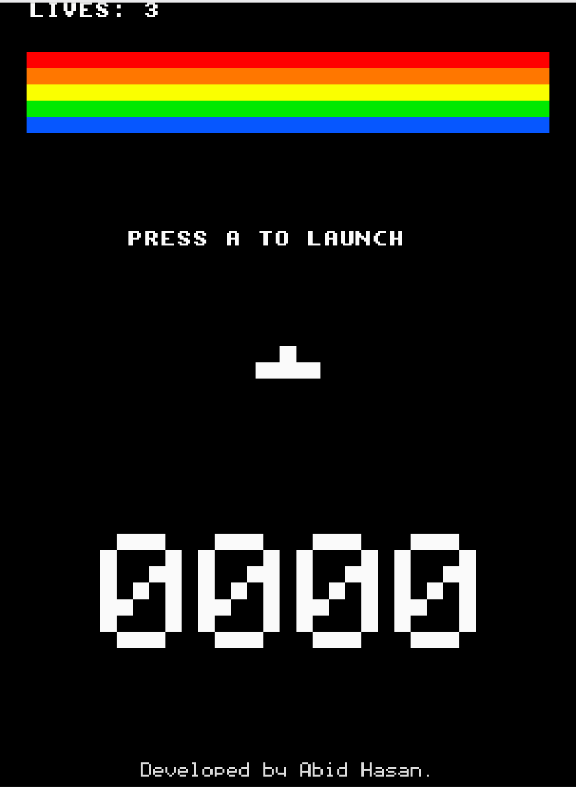

# DX-Ball DS

A DX-Ball / Breakout clone for the Nintendo DS / DSi, written **from scratch** in
C with libnds. No game engine — direct hardware homebrew. Built as my first DSi
project, with `<3`.

> Top screen = gameplay. Bottom screen = score (and a quiet credit line at the
> very bottom).

## Screenshot

<p align="center">
  
</p>

## Features

- 8 × 5 brick wall, one color per row
- Hardware-accelerated sprites (libnds OAM) for paddle, ball, and bricks
- Bitmap-rendered, large 4-digit score on the bottom screen
- Hand-coded 5×7 pixel font shared by the giant score and the small bottom credit
- Paddle-angle ball deflection (the spot you hit affects the bounce vector)
- 3 lives, win / lose states, A-button restart
- Compiles to a plain DS ROM that runs in **DSi DS-mode** on real hardware
- Levels are defined as a compile-time `LevelDef` array — drop in new layouts
  without touching engine code

## Tech stack

- **Language:** C (C99)
- **SDK:** [libnds](https://github.com/devkitPro/libnds) — Nintendo DS hardware
  abstraction (sprite OAM, BG layers, VRAM banks, input, VBlank, console)
- **Toolchain:** [devkitPro](https://devkitpro.org/) / `devkitARM` cross-compiler,
  `ndstool` packer, plain `make`
- **Engine:** none. Collisions, rendering, state machine, font, scoring — all
  hand-written for this project.

## Controls

| Action  | DS button | melonDS default key |
|---------|-----------|---------------------|
| Move paddle | D-pad ← / → | arrow keys |
| Launch ball | A | **X** |
| Restart (after WIN / GAME OVER) | A | **X** |

## Quick start

If you just want to play, grab the prebuilt `dxball.nds` from this repo and load
it in any DS emulator (e.g. melonDS) or copy it to your DSi's SD card.

```sh
melonDS dxball.nds
```

## Build from source

### Prerequisites

- [devkitPro](https://devkitpro.org/wiki/Getting_Started) with the `nds-dev`
  group installed.
  - Provides `devkitARM` + `libnds` + `ndstool`.
  - The `Makefile` expects the standard `$DEVKITARM` environment variable.
- [melonDS](https://melonds.kuribo64.net/) (or any DS emulator) for testing.
- *Optional, for real hardware:* a DSi with a homebrew launcher
  ([TwilightMenu++](https://github.com/DS-Homebrew/TWiLightMenu) /
  [Unlaunch](https://problemkaputt.de/unlaunch.htm)) and a FAT-formatted SD card.

### Compile

```sh
make
```

Output: `dxball.nds` in the project root.

```sh
make clean    # remove build/ and the produced .nds / .elf
```

### If your project path has spaces

The standard devkitPro Makefile doesn't handle spaces in `$(CURDIR)` (`make`
recursion splits on whitespace). If `pwd` contains a space, build via a
space-free copy:

```sh
mkdir -p /tmp/dxball-build
cp -R Makefile source /tmp/dxball-build/
(cd /tmp/dxball-build && make)
cp /tmp/dxball-build/dxball.nds .
```

## Run

### melonDS (emulator)

```sh
melonDS dxball.nds
```

…or `File → Open ROM…` and pick `dxball.nds`.

### Real DSi hardware

1. Copy `dxball.nds` to your DSi's SD card (anywhere — most homebrew launchers
   recursively scan the card).
2. Boot via TwilightMenu++ / Unlaunch / your launcher of choice and pick it.

The ROM is built with `ds_arm9.specs`, so it's a plain DS ROM that runs in
DSi's DS-mode — no DSi-exclusive features required.

## Project layout

```
.
├── Makefile          # devkitPro ds_arm9 template, target = dxball
├── README.md
├── LICENSE
├── .gitignore
├── dxball.nds        # prebuilt ROM (committed for clone-and-play)
└── source/
    ├── main.c        # entry, main loop, init order
    ├── game.c/.h     # state machine, physics, collisions, scoring, lives
    ├── render.c/.h   # video init, VRAM banking, sprites, top-screen HUD
    ├── level.c/.h    # level data + runtime brick grid
    └── score.c/.h    # 5x7 font, bottom-screen score + credit rendering
```

## How the screens are wired

- **Top screen (main 2D engine, `MODE_0_2D`)**
  - **VRAM_A** → main BG (libnds default 8×8 console on BG0 — `LIVES`, win/lose
    messages)
  - **VRAM_B** → main sprite RAM at `0x06400000` (paddle, ball, 40 brick sprites
    in bitmap mode)
- **Bottom screen (sub 2D engine, `MODE_5_2D`)**
  - **VRAM_C** → sub BG, 256×256 16-bpp bitmap on BG2 (the score and the credit
    are written as raw `u16` pixels into this bitmap by the 5×7 font renderer in
    [`source/score.c`](source/score.c))

## Adding more levels

`source/level.c` defines `levels[]`. Add another entry:

```c
{
    {
        {1, 1, 0, 1, 1, 0, 1, 1},
        {1, 1, 1, 1, 1, 1, 1, 1},
        {0, 0, 1, 1, 1, 1, 0, 0},
        {1, 1, 1, 0, 0, 1, 1, 1},
        {1, 0, 1, 0, 1, 0, 1, 0},
    }
},
```

…and call `levelLoad(N)` from your progression logic in `game.c`.

## Development milestones

The game was built incrementally. If you check out historical commits or want
to re-verify behavior, the milestones are:

1. **Skeleton compiles** — `make` produces `dxball.nds`. Two black screens.
2. **Both screens initialize** — independent video modes, distinct backdrops.
3. **Paddle moves** — D-pad ← / → slides the paddle.
4. **Ball launches & bounces** — A launches; walls + paddle deflect.
5. **Bricks** — 8×5 grid renders; each disappears on hit.
6. **Score** — bottom-screen large 4-digit count updates in real time.
7. **Win / Lose** — `YOU WIN` / `GAME OVER`, A restarts.

## Out of scope (for this version)

- No sound / music
- No title screen — boots straight into play
- No power-ups, multi-ball, or high-score saving
- No touchscreen input

## Acknowledgments

- [devkitPro](https://devkitpro.org/) for the toolchain
- [libnds](https://github.com/devkitPro/libnds) for the DS hardware abstraction
- [melonDS](https://melonds.kuribo64.net/) for the emulator
- The original *DX-Ball / Breakout / Arkanoid* lineage that inspired the
  gameplay

## License

[MIT](LICENSE) © 2026 Abid Hasan
